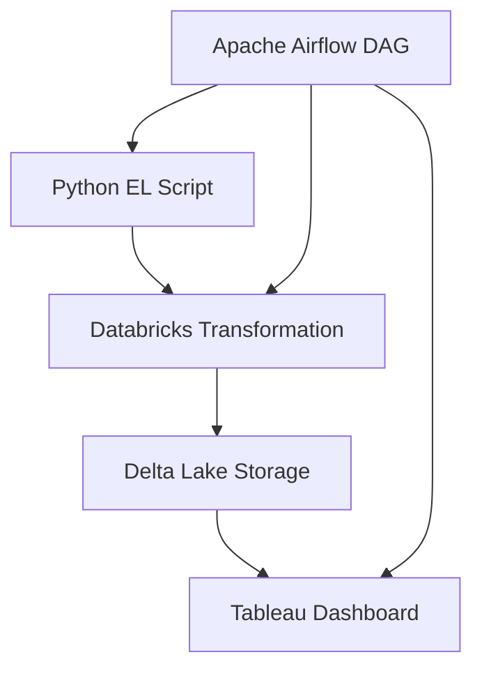

# 🧮 Target Retail Analytics Pipeline (Airflow · Databricks · Tableau)

This project demonstrates an **end-to-end automated data analytics pipeline** orchestrated using **Apache Airflow**, powered by **Databricks SQL** transformations, and visualized with **Tableau**.  

Inspired by **Target’s retail operations**, this project analyzes **synthetic sales, product, and customer data** from **2020 to 2023**.  
The pipeline automates data ingestion, transformation, and dashboard refresh to produce actionable insights on performance, customer trends, and geographic behavior.  

---

## 🧭 Project Overview  

**🎯 Objective:**  
Build an automated and scalable analytics pipeline to demonstrate the integration of modern data tools — from ingestion to visualization — for retail performance monitoring.

**🚀 Outcomes:**  
- Automated ingestion and cleaning of retail data using Python  
- Transformations and KPI computation in Databricks (SQL + PySpark)  
- Workflow orchestration with Apache Airflow DAGs  
- Interactive Tableau dashboards for insights and storytelling  

---

## ⚙️ Architecture  

### 🧩 Tools & Technologies  

| Layer | Tool | Description |
|-------|------|-------------|
| **Extraction & Loading (EL)** | 🐍 **Python (pandas, requests)** | Automate ingestion of synthetic CSV data to Databricks |
| **Transformation (T)** | 🔥 **Databricks SQL / PySpark** | Perform data modeling, joins, and KPI aggregations |
| **Storage** | 💾 **Delta Lake** | Store incremental and versioned analytical tables |
| **Orchestration** | 🪶 **Apache Airflow** | Manage task dependencies, scheduling, and monitoring |
| **Visualization** | 📊 **Tableau** | Build interactive dashboards with KPIs and filters |

---

## 🪜 Pipeline Workflow  

1. **Python EL Task**  
   - Reads raw data (sales, customers, products) from local or cloud sources  
   - Cleans, validates, and uploads data to Databricks staging tables  

2. **Databricks Transformation Task**  
   - Executes SQL scripts for cleaning, enrichment, and KPI computation  
   - Creates aggregated analytical tables optimized for Tableau  

3. **Tableau Refresh Task**  
   - Connects Tableau to Databricks output tables  
   - Refreshes extracts or live connections for up-to-date visuals  

4. **Airflow DAG**  
   - Orchestrates all steps in sequence  
   - Includes retry logic, failure alerts, and daily scheduling  

---

## 📊 Dashboard Overview  

### 💰 Sales Dashboard  
Focuses on sales trends, profitability, and product-level performance.  
Includes KPIs for Total Sales, Profit, YoY Growth, and Category Rankings.

### 👥 Customer Dashboard  
Analyzes customer behavior, purchase frequency, and lifetime value.  
Highlights top-performing customers and repeat purchase patterns.

📸 *Dashboard Previews:*  
  

---

## 🧮 KPIs & Metrics  

| Category | Metrics |
|-----------|----------|
| **Performance** | Total Sales, Sales Growth vs PY, Profit Margin, Quantity Sold |
| **Product-Level** | Sales by Category, Profit/Loss by Product Line, Top & Bottom SKUs |
| **Customer** | Total Customers, Avg Sales per Customer, Order Frequency |
| **Geographic** | Sales by State, Regional Profit Share, Sales Density Maps |

---

## 🧠 Key Learnings  

- Built and automated an **ETL pipeline** with **Apache Airflow DAGs**  
- Used **Databricks SQL** and **PySpark** for scalable transformations  
- Implemented **incremental data loads** using **Delta Lake**  
- Created **interactive Tableau dashboards** for business storytelling  
- Understood **workflow orchestration, scheduling, and dependency management**

---

## 📈 Results  

- Automated daily refresh of sales and customer data  
- Eliminated manual Tableau updates via Airflow orchestration  
- Delivered an **executive-ready dashboard** summarizing key business KPIs  
- Demonstrated **integration of engineering + analytics + visualization**

---

## 📝 Disclaimer  

This is an **academic and portfolio project** developed for learning purposes.  
All data is **synthetic** and not affiliated with **Target Corporation**.

**🔗 Live Dashboard:**  
👉 [View on Tableau Public](https://public.tableau.com/app/profile/shrushti.agarwal/viz/TargetStoreDashboard/SalesDashboard)

---

## 💡 Future Enhancements  

- Integrate **forecasting models** (e.g., ARIMA, Prophet) in Databricks  
- Containerize pipeline using **Docker** and deploy via **Airflow on Cloud Composer**

---

👩‍💻 **Author:** *Shrushti Agarwal*  
📫 **Contact:** [LinkedIn](https://www.linkedin.com/in/shrushti-agarwal) · [GitHub](https://github.com/)
